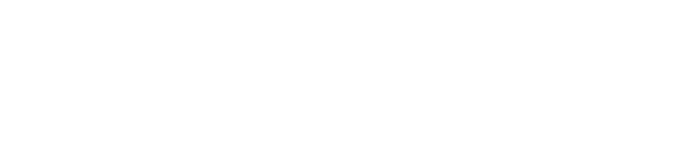

# Redesign

[](https://stitchredesign.com)
[](https://github.com/SiddhantaChandra/redesign)

An open-source library of design specifications (designs.md) for [Google Stitch](https://stitch.withgoogle.com/). Browse, search, and copy design prompts to jumpstart your AI-powered design workflow.



## Table of Contents

- [Getting Started](#getting-started)
  - [Fork & Clone](#fork--clone)
  - [Installation](#installation)
  - [Development](#development)
  - [Building for Production](#building-for-production)
- [Contributing](#contributing)
  - [Adding a New Design](#adding-a-new-design)
  - [Submitting via Pull Request](#submitting-via-pull-request)
- [Designs.md Format](#designsmd-format)
  - [What is designs.md?](#what-is-designsmd)
  - [File Structure](#file-structure)
  - [Recommended Sections](#recommended-sections)
  - [Example Template](#example-template)

---

## Getting Started

### Fork & Clone

1. **Fork the repository** on GitHub:
   - Visit [github.com/SiddhantaChandra/redesign](https://github.com/SiddhantaChandra/redesign)
   - Click the **"Fork"** button in the top-right corner
   - This creates your own copy of the repository under your GitHub account

2. **Clone your fork locally**:

   ```bash
   # Using HTTPS
   git clone https://github.com/YOUR_USERNAME/redesign.git

   # Using SSH
   git clone git@github.com:YOUR_USERNAME/redesign.git
   ```

3. **Navigate to the project**:

   ```bash
   cd redesign
   ```

### Installation

This project uses **Bun** as its package manager.

```bash
# Install dependencies
bun install
```

### Development

Start the development server:

```bash
bun run dev
```

The site will be available at `http://localhost:3000`.

Available scripts:

| Command            | Description                                  |
| ------------------ | -------------------------------------------- |
| `bun run dev`      | Start development server with hot reload     |
| `bun run build`    | Build for production                         |
| `bun run start`    | Start production server                      |
| `bun run lint`     | Run ESLint                                   |
| `bun run generate` | Regenerate designs index from markdown files |

### Building for Production

```bash
# Build the application
bun run build

# Start the production server
bun run start
```

---

## Contributing

We welcome contributions! Whether you're fixing a bug, improving documentation, or adding a new design specification.

### Adding a New Design

Designs are stored as Markdown files (`.md`) in the `/designs` directory.

#### File Naming & Structure

```
designs/
├── design-name.md          # Single design (slug: "design-name")
└── author-name/
    └── design-name.md      # Author subfolder (slug: "author-name/design-name")
```

**Rules:**

- Use **kebab-case** for filenames (e.g., `dark-dashboard.md`, `ecommerce-template.md`)
- Optional: Organize designs under author folders for attribution
- File extension must be `.md`

#### Steps to Add a Design

1. **Create your design file** in the appropriate location:

   ```bash
   # For a single design
   touch designs/my-awesome-design.md

   # For an authored design
   mkdir -p designs/your-github-username
   touch designs/your-github-username/my-design.md
   ```

2. **Write your design specification** following the [Designs.md Format](#designsmd-format) guidelines below.

3. **Regenerate the index** (optional - happens automatically on build):

   ```bash
   bun run generate
   ```

4. **Test locally**:

   ```bash
   bun run dev
   ```

   Visit `http://localhost:3000` and verify your design appears in the list and renders correctly.

### Submitting via Pull Request

1. **Create a new branch** for your changes:

   ```bash
   git checkout -b add/my-design-name
   ```

2. **Add and commit your design**:

   ```bash
   git add designs/my-design-name.md
   git commit -m "Add design: My Design Name"
   ```

3. **Push to your fork**:

   ```bash
   git push origin add/my-design-name
   ```

4. **Open a Pull Request**:
   - Go to your fork on GitHub
   - Click **"Compare & pull request"**
   - Fill in the PR template with:
     - Design name and description
     - Screenshots or examples (if applicable)
     - Any additional context

5. **Wait for review** - Maintainers will review your submission and provide feedback if needed.

#### PR Guidelines

- Ensure your design follows the [designs.md format](#designsmd-format)
- Use clear, descriptive commit messages
- Keep designs focused and well-structured
- Test your design renders correctly before submitting
- Be open to feedback and revisions

---

## Designs.md Format

### What is designs.md?

**Designs.md** is a markdown-based format for documenting design specifications that can be used with AI design tools like [Google Stitch](https://stitch.withgoogle.com/). It provides a structured way to describe:

- Visual design systems (colors, typography, spacing)
- Component specifications
- Layout patterns
- Interaction guidelines
- Responsive behavior

Learn more at the [official Stitch documentation](https://stitch.withgoogle.com/docs/design-md/overview).

### File Structure

Each `.md` file in the `/designs` directory represents a single design specification. The file is automatically parsed and indexed when the site builds.

**Supported locations:**

- `designs/design-name.md` → Slug: `design-name`
- `designs/author-name/design-name.md` → Slug: `author-name/design-name`

---

## Tech Stack

- **Framework**: [TanStack Start](https://tanstack.com/start) (React + Vite)
- **Styling**: [Tailwind CSS](https://tailwindcss.com/)
- **Routing**: [TanStack Router](https://tanstack.com/router)
- **Icons**: [Phosphor Icons](https://phosphoricons.com/)
- **Search**: [Fuse.js](https://fusejs.io/)
- **Markdown**: [react-markdown](https://github.com/remarkjs/react-markdown)

---

## License

MIT License - feel free to use this project for your own purposes.

---

## Support

- Visit the live site: [stitchredesign.com](https://stitchredesign.com)
- Report issues: [GitHub Issues](https://github.com/SiddhantaChandra/redesign/issues)
- Learn about Stitch: [stitch.withgoogle.com](https://stitch.withgoogle.com/)

---